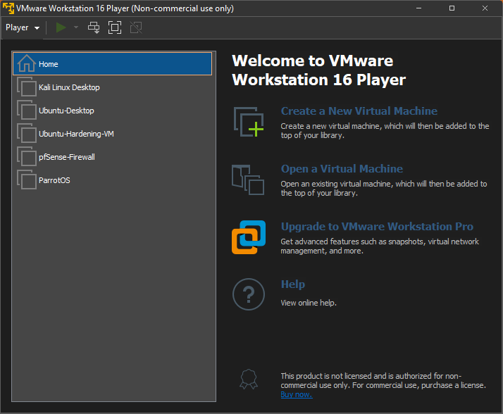
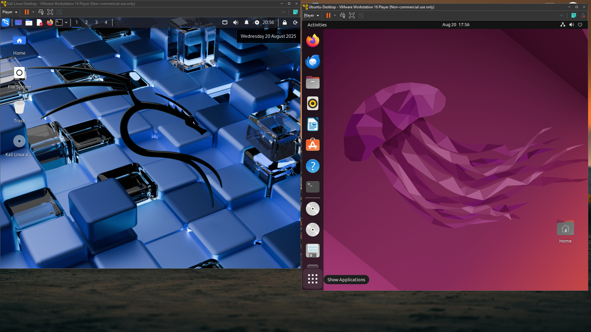
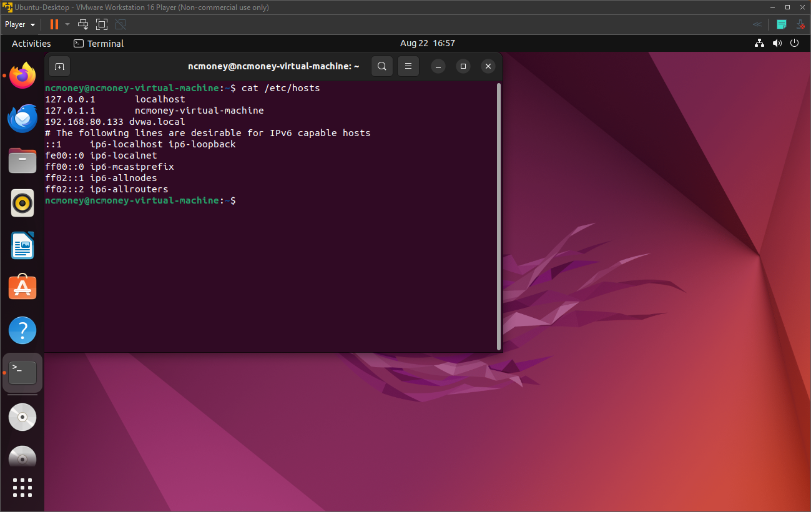
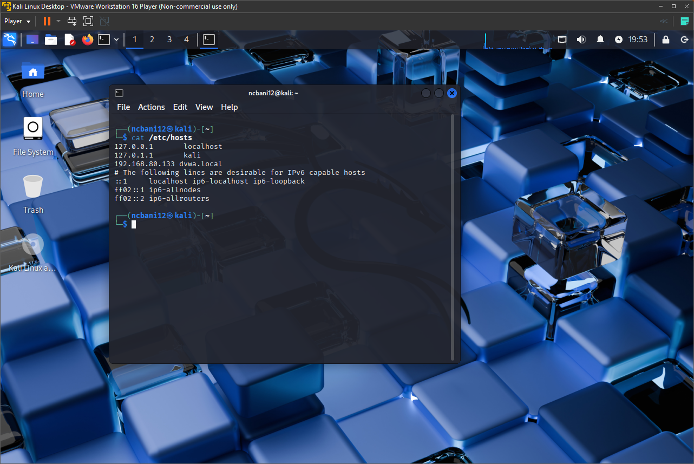
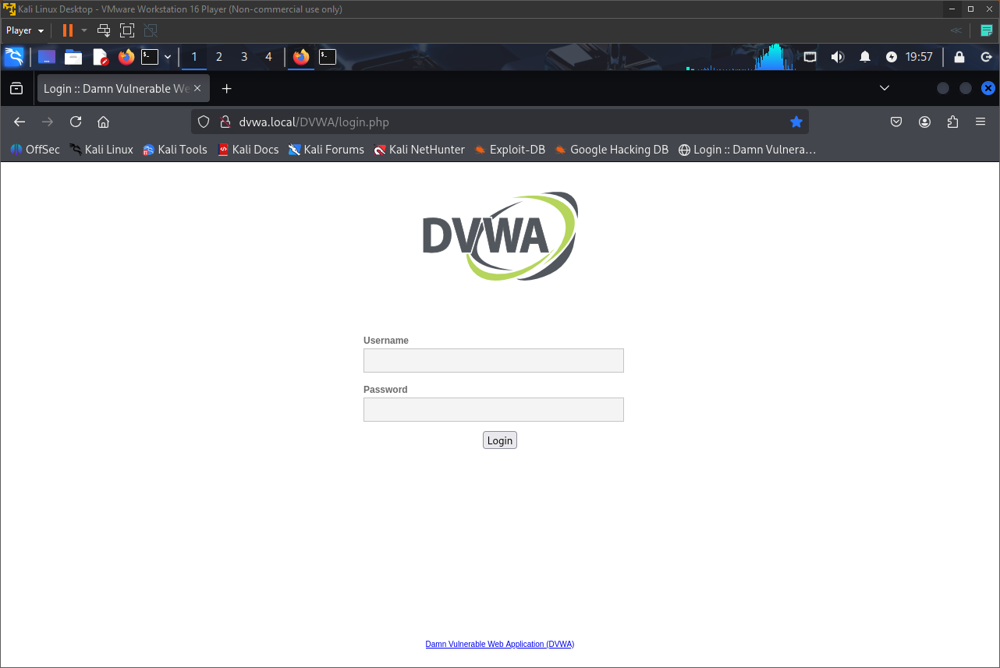
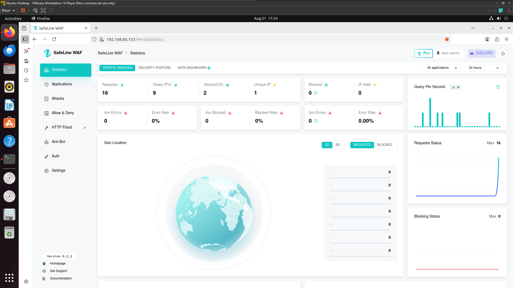
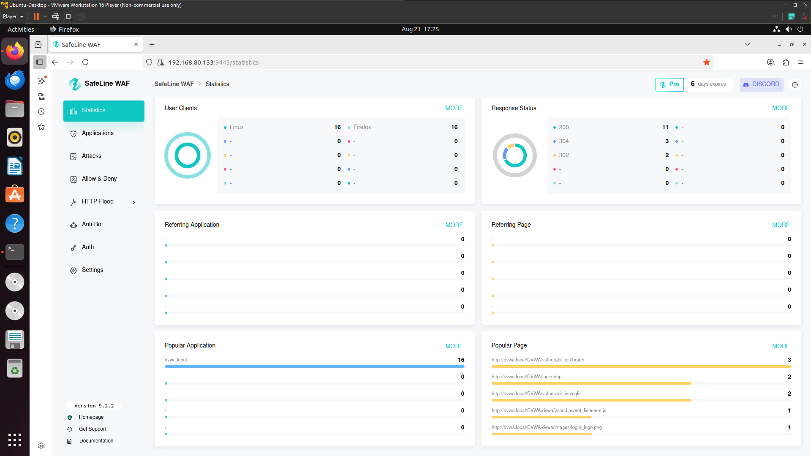
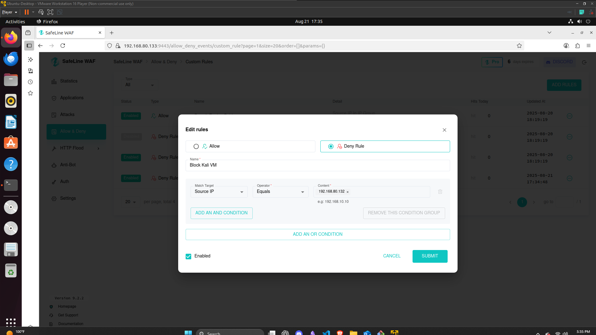
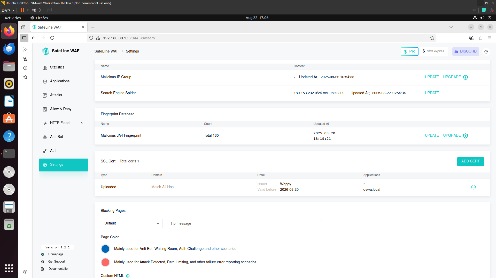

# Web Application Security Home Lab

## Overview
This project demonstrates a home lab environment I built to practice web application security concepts, including deploying a vulnerable web application (DVWA), configuring a Web Application Firewall (WAF), and enforcing security rules.  

The lab simulates a real-world scenario where a web server is protected by a WAF, and attacker/defender dynamics can be tested.

---

## Topology

- **Victim / App Host:** Ubuntu Desktop VM  
- **Attacker:** Kali Linux Desktop VM  
- **App:** DVWA (PHP) on Apache + MySQL  
- **WAF/Proxy:** SafeLine WAF on Ubuntu (fronting Apache)  
- **Name Resolution:** `/etc/hosts` on both VMs (e.g., `dvwa.local`)  

📷 Network Diagram:  
  
  

---

## Setup Process

### 1. Virtual Machines
- Created two VMs:  
  - Ubuntu Desktop → hosting the DVWA server + WAF  
  - Kali Linux → attacker machine for testing  
- Configured a **bridged network** in VMware.  
- Set up `/etc/hosts` on both machines to map hostnames.  

📷 `/etc/hosts` screenshots:  
  
  

---

### 2. LAMP Stack & DVWA Installation
- Installed **Apache2, MySQL, PHP** on Ubuntu.  
- Deployed **DVWA** into Apache’s web root.  
- Configured `config.inc.php` with database credentials.  
- Verified DVWA login page worked.  

📷 DVWA Login:  
  

---

### 3. SafeLine WAF Setup
- Installed **SafePoint WAF** on Ubuntu.  
- Configured it to proxy DVWA traffic.  
- Verified DVWA accessible through WAF.  

📷 WAF Dashboard:  
  
  

---

### 4. Firewall Rules
- Added a rule to block all traffic from Kali VM’s IP.  
- Verified traffic was blocked from Kali, allowed from other sources.  

📷 Blocked request:  
  

---

### 5. SSL/TLS Configuration
- Generated a certificate & key on Kali.  
- Imported into WAF to enable HTTPS.  
- Confirmed secure DVWA access at `https://dvwa.local`.  

📷 Certificate:  
  

---

## Key Takeaways
- Set up a **LAMP stack** with DVWA.  
- Gained experience with a **Web Application Firewall**.  
- Implemented **access controls** and firewall rules.  
- Configured **Self Signed Cert & Private Key** manually.  
- Built a strong foundation in **defending web apps** in a controlled lab.

---

## References 
- [SafeLine WAF Documentation](https://safeline.com/)  
